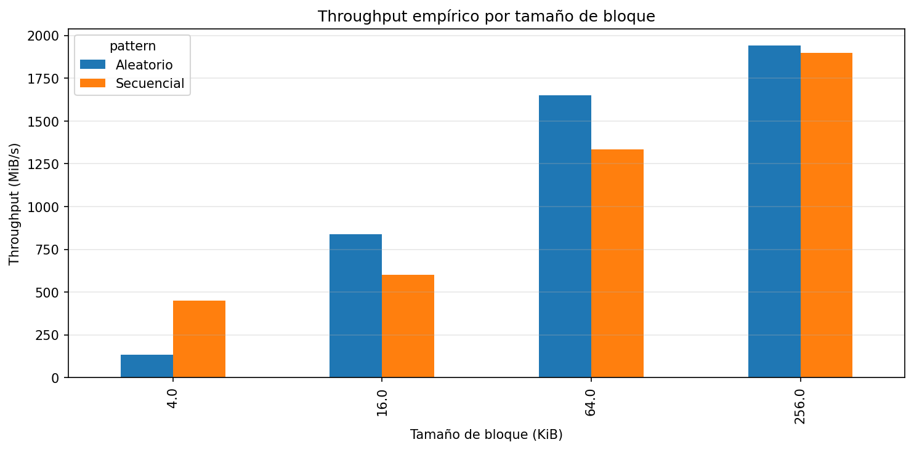
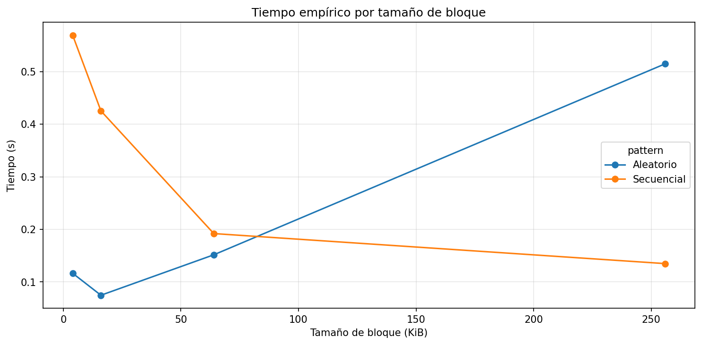
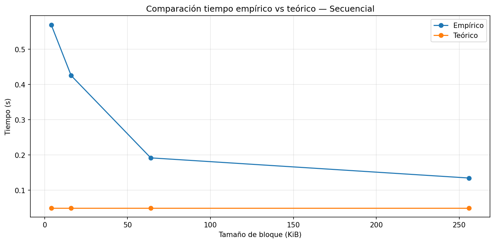
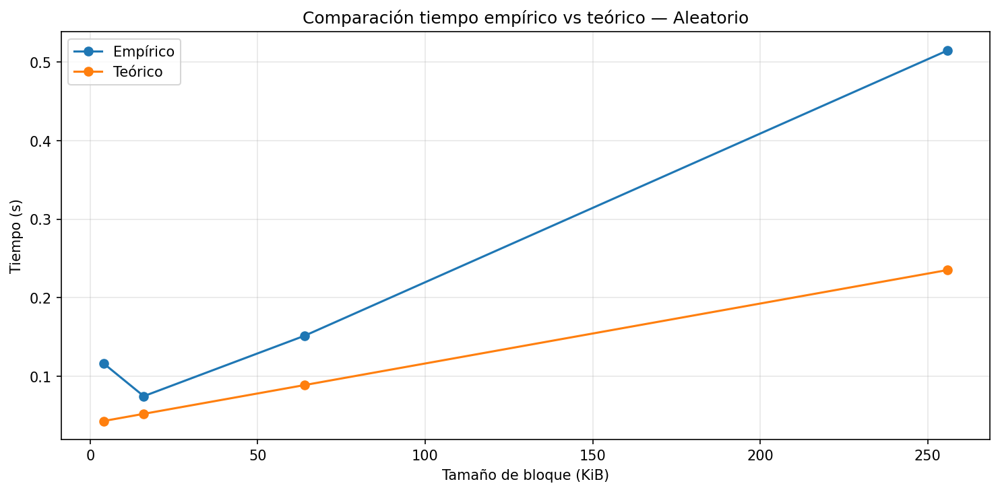
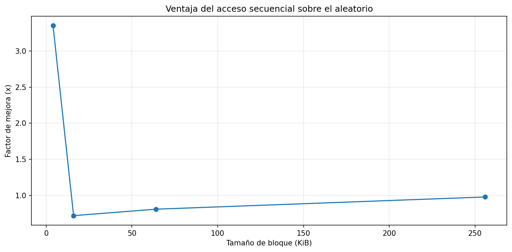

# lab3-IO_performance-ValentinaGarro

## 1. Especificaciones del equipo.

| Parámetro | Valor Observado |
|---|---|
| Sistema Operativo | Windows 10 |
| CPU | Intel i3 - 101100 @ 2.10GHz |
| Arquitectura y Núcleos | x64 / 2 núcleos físicos (4 lógicos) | 
| Memoria RAM total | 12 GB | 
| Tecnología de Almacenamienti | SSD NVMe | 
| Carga de CPU en reposo (%) | 8% | 

## 2. Resultados (Gráficas).

# Gráfica 1: Throughput:

# Gráfica 2: Tiempo empírico por tamaño de bloque:

# Gráfica 3: Comparación tiempo empírico VS teórico - Secuencial:

# Gráfica 3: Comparación tiempo empírico VS teórico - Aleatorio:

# Gráfica 4: Ventaja secuencial sobre aleatorio:

## 3. Análisis.

a. Diferencial de Desempeño: ¿Cuál patrón de acceso resultó ser más eficiente en su máquina y cuál es la proporción de diferencia (ventaja secuencial)?
    R/: El acceso secuencial demostró ser en gran parte mucho más eficiente para la mayoría de los bloques analisados. Pero para el caso 4 KiB presenta un resultado llamativo, podemos observar que allí el tiempo del acceso secuencial (0.569 s) fue mayor que el del acceso aleatorio (0.116 s), esto implica un speedup de 3.3× a favor del aleatorio para este caso.
    En su lugar si consideramos los bloques de 256 KiB, el comportamiento cambia en el acceso secuencial se logra un rendimiento de 1898 MiB/s frente a 1942 MiB/s del aleatorio, acercándose a un speedup de ~0.98×, esto quiere decir que ambos patrónes se vuelven casi equivalentes.
    Este comportamiento se puede relacionar con la granularidad de las operaciones entrada/salida: al usar bloques pequeños, el acceso secuencial acumula mayor sobrecarga por llamadas al sistema relacionadas con la cantidad de datos transferidos. Por otra parte al trabajar con bloques grandes, ese costo fijo por operación se distribuye entre más datos, esto provoca que las diferencial entres acceso secuencial y aleatorio se reduzcan.

b. Efecto del Tamaño de Bloque: ¿Cómo influye el tamaño de la unidad de lectura en la mitigación del costo del acceso aleatorio?
    R/: El tamaño del bloque influye determinante en el costo relativo del acceso aleatorio. Dependiendo de los datos en el tipo de acceso aleatorio para bloques de 4 KiB aumentó a 134 MiB/s, mientras que con bloques de 256 KiB a 1942 MiB/s, esto representa una mejora superior a 14× solo por incrementar el tamaño del bloque.
    Esto se debe a que para el acceso aleatorio se tiene en cuenta un costo fijo considerable para cada operación (gestión de la cola de I/O, los posibles fallos en el caché). Por el contrario, al trabajar con bloques más grandes, este costo es repartido en una mayor cantidad de datos útiles.
    Desde un punto de vista teóricos, al incrementar el tamaño del bloque se disminuyen el número de operaciones, lo que hace que las diferencias entre patrones de acceso se reduzcan. Esto explica porque en la práctica con bloques de 256 KiB, la ventaja del acceso secuencial frente al aleatorio se reduce hasta un speedup cercano a 1.0×.

c. Correlación con la Teoría: ¿En qué puntos su hardware se alejó más del modelo teórico y qué factores físicos (interfaz, temperatura, caché) podrían explicarlo?
    R/: Para el modelo teórico se estimaron tiempos casi constantes en el acceso secuencial y para el acceso aleatorio un incremento moderado, pero en ambos casos se subestimó de forma sistemática los valores reales. La diferencia más notable se puede evidenciar en bloques de 4 KiB en el acceso secuencial, donde el iempo medido fue de 0.569 s frente a unos ~0.05 s estimados, es decir, más de diez veces superior.
    Esto se debe a varios factores que no se contemplan en el modelo. Por un lado el overhead de las llamadas al sistema se vuelve muy significativo con bloques pequeños, ya que ejecutan numerosas operaciones por segundo. Por otro lado la caché del sistema operativo puede no estar inicializada al inicio de la prueba, esto puede provocar fallos de caché costosos. Por último, el SSD puede experimentar throttling térmico, esto puede ocasionar una reducción de rendimiento en especial cuando se somete a ráfagas intensas de operaciones.
    Como consecuencia, al basarse solamente en el ancho de banda, el modelo teórico funciona como una referencia, pero no como una representación precisa del comportamiento real del hardware bajo condiciones variables.

d. Costo de Acceso: Explique por qué, incluso en unidades de estado sólido (SSD) sin componentes mecánicos, el acceso aleatorio sigue siendo más costoso que el secuencial.
    R/: Aunque los SSD son los encargados de suprimir la latencia mecánica de los discos tradicionales, el acceso aleatorio continúa siendo más costoso que el secuencial debido a factores electrónicos y de software. Cada operación aleatoria implica lo siguiente: traducir direcciones lógicas a físicas mediante la tabla FTL del controlador, ctivar distintos bloques de memoria en cada acceso; esto impide el aprovechamiento de los mecanismos como el prefetching en accesos contiguos, y finalmente generar una interrupción junto con un cambio de contexto en el sistema operativo por cada solicitud de entrada/salida.
    En los resultados, se evidencia que con bloques de 256 KiB al acceso aleatorio le tomó 0.51s, mientras que el secuencial solo 0.135 s, a pesar de manejar la misma cantidad de datos. Teniendo presente la teoría, este comportamiento se asocia al término n × t_overhead del modelo de costo; donde en el acceso seuencial, n es bajo porque se realizan pocas operaciones de gran tamaño, mientras que en el acceso aleatorio n aumenta, ya que al tener bloques dispersos esto implica operaciones independientes.

e. Implicaciones en Sistemas: Si usted estuviera diseñando un Motor de Base de Datos, ¿de qué manera utilizaría estos hallazgos para optimizar la velocidad de recuperación de registros?
    R/: Teniendo presente los resultados obtenidos, el diseño de un motor de base de datos debería apoyarse en tres ideas. En primer lugar se recomienda establecer tamaños entre 64 KiB y 256 KiB, ya que en estos intervalos el rendimiento secuencial supera los 1333 MiB/s y la desventaja para el acceso secuencial disminuye; del mismo modo las consultas que son por índice, que suelen ser aleatorias, pueden acercarse al máximo desempeño del dispositivo.
    En segundo lugar, es conveniente implementar un buffer pool con mecanismos de prefetching secuencial. Esto dado a que en el acceso secuencial se reduce el costo por operación, lo que es útil para que el sistema anticipe la carga de páginas contiguas antes de que sean requeridas, de este modo se aprovecharian las optimizaciones internas del sistema y del controlador del SSD para accesos consecutivos.
    Para finalizar, se recomienda organizar los datos que se recorren con frecuencia es estructuras continuas, dejando de este modo los índices tipo B-tree para consultas específicas donde el acceso aleatorio es inevitable, pero realizando esta acción sobre los bloques ya optimizados. Esta estrategia se puede relacionar con el principio de localidad de referencia, donde al aumentar al cercanía espacial de los datos, se reduciria la cantidad de operaciones de entrada/salida, teniendo en cuenta que es un factor que impacta negativamente en el rendimiento.

## 4. Conclusión:

- Podemos concluir que la información en el disco se almacena en bloques de tamaño fijo, los cuales contituyen la unidad mínima que el 
sistema operativo tiene la capacidad de leer o escribir en cada operación entrada - salida. Esta característica es clave, ya que define 
cuantas llamadas al sistema se necesitan para transferir cierta cantidad de datos y como consecuencia el nivel de sobrecarga asosiados 
a cada patrón de acceso. Aunque el SSDD se encarga de eliminar la latencia mecánica de los discos tradicionales, no suprime en su 
totalidad los costos derivados de las llamadas al sistema, ni la gestión de solicitudes. Por ello, el acceso aleatorio continua siendo 
más costoso que el secuencial. Esto se puede observar, en los bloques de 4 KiB, donde el acceso secuencial se tarda 0.57s frente a 0.
12s del aleatorio, generando asi un speedup de 3.3x.
El modelo teórico, se basa en el ancho de la banda, subestimando asi los tiempos reales en ambos casos, prediciendo valores casi 
constantes para el acceso secuenial y un crecimiento moderado en el aleatorio, sin tener en cuenta la sobrecarga por operación ni la 
ineficiencia de leer bloques grandes dispersos. Estas diferencias dejan en eviencia que el modelo funciona como referencia, pero no 
como una representación real del comportamiento del hardware.
A partir de los resultados obtenidos anteriormente, se podría recomendar un entorno práctico para agrupar lecturas pequeñas en bloque 
de al menos 64 KiB, donde el rendimiento secuencial supera los 1300 MiB/s, con el fin de aprovechar mejor la caché del sistema 
operativo y reducir la cantidad de operaciones. El acceso aleatorio debería de reservarse para situaciones donde sea estrictamente 
necesario.

## 5. Preguntas de cierre:

**1. Comparación de patrones:** Con base en sus mediciones, ¿cuántas veces más rápido fue el acceso secuencial respecto al aleatorio en su equipo? ¿Ese resultado era el esperado según la teoría?
    R/: Para los bloque de 4 KiB, el acceso aleatorio resultó ser más rápido que el secuencial, en su lugar cuando se aumentó de tamaño a 256 KiB, ambos métodos mostraron un rendimiento muy similar. Este comportamiento no coincide con la teoría, la cual suele anticipar una ventaja constante del acceso secuencial. 
    Esta diferencia radica en que, con bloque pequeños el costo de las llamadas al sistema afecta en mayor medida al acceso secuencial.

**2. Efecto del tamaño de bloque:** ¿Qué ocurrió con el throughput del acceso aleatorio a medida que aumentó el tamaño de bloque? ¿Por qué cree que sucede eso?
    R/: En el acceso aleatorio el rendimiento aumentó a 134 MiB/s con los bloques de 4 KiB mientras que con los bloques de 256 KiB aumentó a 1942 MiB/s, estó representa una mejora cercana a 14 veces. Esto se debe a que, al incrementar el tamaño del bloque, el costo de cada operación se reparte entre la amayor cantidad de datos útiles. Desde un punto de vista teóricos, al incrementar el tamaño del bloque se disminuyen el número de operaciones, lo que hace que las diferencias entre patrones de acceso se reduzcan.

**3. Teoría vs práctica:** Identifique un caso en sus resultados donde la medición empírica se alejó del modelo teórico. ¿A qué factor atribuye esa diferencia?
    R/: La diferencia más notable se puede evidenciar en bloques de 4 KiB en el acceso secuencial, donde el iempo medido fue de 0.569 s frente a unos ~0.05 s estimados, es decir, más de diez veces superior. Esta diferencia es principalmente por el costo acumulado de numerosas llamadas al sistema, un aspecto que el modelo teórico no tiene presente. Esto demuestra que el modelo es efectivo cuando la cantidad de operaciones son reducidas.

**4. Tipo de disco:** Compare sus resultados con los valores de referencia de la tabla de la guía. ¿Su equipo se comportó como un HDD, un SSD SATA o un SSD NVMe?
    R/: Teniendo un rendimiento de 1898 MiB/s en acceso secuencial y 1942 MiB/s en acceso aleatorio para los bloques de 256 KiB, el comportamiento de mi dispositivo corresponde perfectamente al de un SSD NVMe. Estas cifras sobrepasan el límite típico de un SSD SATA (alrededor de 550 MiB/s) y están por encima del rendimiento de un disco duro tradicional (cerca de 160 MiB/s). La interfaz PCIe propia de los NVMe permite, en bloques grandes, el acceso aleatorio alcance un desempeño similar al secuencial.

**5. Aplicación práctica:** Imagine que debe almacenar una tabla deestudiantes con 1 millón de registros. Con base en lo que midió, ¿preferiría leerla toda de forma secuencial o acceder a registros individuales de forma aleatoria? ¿Por qué?
    R/: Para procesar 1 millón de registros, se optaría por un acceso secuencial, ya que teniendo un rendimiento de 1898 MiB/s la tarea se realizaría en poco tiempo. Sin embargo, con un acceso aleatorio registro por registro implicaría la ejecución de milliones de operaciones independientes, cada una contando con su propio costo, esto podría extender la ejecución a decenas de segundos. Por esta razón, el acceso aleatorio es el más optimo para consultas específicas, pero no para recorridos masivos de datos.
